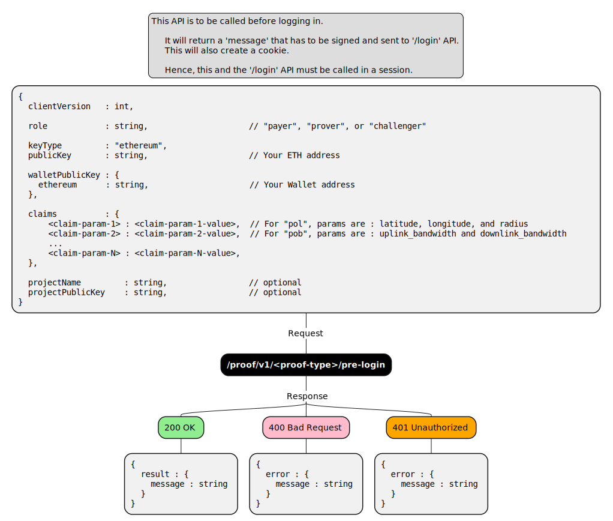

# Pre Login

## Description

	This API is to be called before logging in.                              
                                                                                 
	It will return a 'message' that has to be signed and sent to '/login' API.
        This will also create a cookie.                                      
                                                                                 
	Hence, this and the '/login' API must be called in a session.

## Flow

